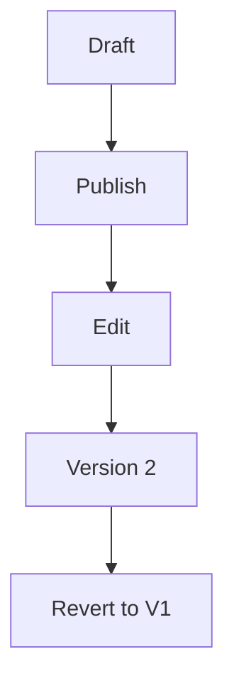

## Overview

Mahmoud Nasif provides powerful tools to streamline your documentation workflow. You create, edit, collaborate, organize, and publish docs efficiently. Focus on content while the platform handles version control, search, and sharing.

<Columns cols={3}>
  <Card title="Document Creation" icon="edit-3" href="#document-creation">
    Build rich pages with markdown and components.
  </Card>
  <Card title="Version Control" icon="git-branch" href="#version-control">
    Track changes with full history and diffs.
  </Card>
  <Card title="Collaboration" icon="users" href="#collaboration">
    Invite teams and review edits in real-time.
  </Card>
  <Card title="Search & Organization" icon="search" href="#search-organization">
    Find content quickly across your docs.
  </Card>
  <Card title="Export & Publish" icon="share-2" href="#export-publish">
    Generate PDFs, HTML, or custom sites.
  </Card>
</Columns>

## Document Creation and Editing Tools

Start new documents from templates or blank pages. The editor supports markdown, MDX components, and live previews.

<Steps>
  <Step title="Create a Page" icon="plus">
    Navigate to your workspace and click `New Page`.

    ```bash
    curl -X POST https://api.example.com/docs \
      -H "Authorization: Bearer YOUR_API_KEY" \
      -d '{"title": "My Guide", "content": "# Hello"}'
    ```
  </Step>
  <Step title="Edit with Components">
    Use the visual editor for `<Callout>` and code blocks. Preview changes instantly.
  </Step>
  <Step title="Save Draft">
    Auto-save ensures you never lose work.
  </Step>
</Steps>

<Callout kind="tip">
  Enable rich text mode for non-technical users.
</Callout>

## Version Control and History Tracking

Every edit creates a version. View diffs, revert changes, or compare branches.



Access history via the page menu. Branches support long-term projects.

## Collaboration and Sharing Options

Invite users with role-based access: viewer, editor, admin.

<Tabs>
  <Tab title="Invite Team" icon="mail">
    Share links or add emails directly.

    <CodeGroup tabs="API,cURL">
    ````javascript
    const response = await fetch('https://api.example.com/workspaces/{workspaceId}/invites', {
      method: 'POST',
      headers: { 'Authorization': 'Bearer YOUR_API_KEY' },
      body: JSON.stringify({ email: 'team@company.com', role: 'editor' })
    });
    ````
    ````bash
    curl -X POST https://api.example.com/workspaces/{workspaceId}/invites \
      -H "Authorization: Bearer YOUR_API_KEY" \
      -d '{"email": "team@company.com", "role": "editor"}'
    ````
    </CodeGroup>
  </Tab>
  <Tab title="Real-time Comments">
    Leave inline feedback without editing.
  </Tab>
</Tabs>

## Search and Organization Features

Full-text search indexes titles, content, and tags. Organize with folders, tags, and pinning.

<Expandable title="Advanced Filters" default-open="false">

Filter by date, author, or tags. Example query: `from:team status:published`.

</Expandable>

## Export and Publishing Capabilities

Publish to custom domains or export formats.

| Format | Use Case | Supported |
|--------|----------|-----------|
| PDF | Printing | Yes |
| HTML | Hosting | Yes |
| Markdown | GitHub | Yes |
| JSON | API | Yes |

<Callout kind="success">
  Custom domains update in `<1min`.
</Callout>

Integrate via webhooks for CI/CD.

```
Learn more in [Quickstart](/quickstart) or [Authentication](/authentication).
```