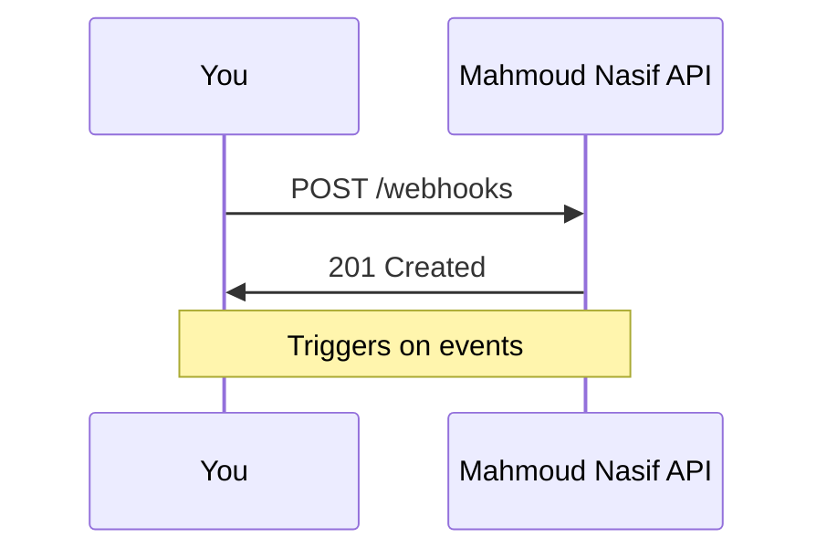

## Overview

Connect Mahmoud Nasif to your favorite third-party tools for seamless workflows. You can set up webhooks for real-time notifications, embed external content like videos or forms, customize themes with your brand color (`#3B82F6`), and access the API for advanced integrations. These features help you tailor the documentation space to your project's needs.

<Columns cols={3}>
  <Card title="Third-Party Apps" icon="plug" href="#third-party-apps">
    Connect Slack, GitHub, and more.
  </Card>
  <Card title="Webhooks" icon="zap" href="#webhooks">
    Automate notifications.
  </Card>
  <Card title="API Access" icon="code" href="#api-access">
    Build custom integrations.
  </Card>
</Columns>

## Third-Party App Connections

Integrate Mahmoud Nasif with popular services to sync documentation updates.

<Tabs>
  <Tab title="Slack" icon="message-circle">
    Send notifications to your Slack channel on document updates.
    
    <Steps>
      <Step title="Connect Slack">
        Go to Settings > Integrations > Slack and authorize the app.
      </Step>
      <Step title="Select Channel">
        Choose your channel and test the connection.
      </Step>
    </Steps>
  </Tab>
  <Tab title="GitHub" icon="github">
    Automatically create issues from documentation feedback.
    
    ```javascript
    // Example GitHub webhook payload
    {
      "action": "opened",
      "issue": {
        "title": "Doc feedback: Update quickstart",
        "body": "Clarify Step 2."
      }
    }
    ```
  </Tab>
</Tabs>

<Callout kind="tip">
  Start with one integration to test, then scale to multiple apps.
</Callout>

## Webhook Setup for Automation

Set up webhooks to trigger actions in external services like Zapier or your custom server.

<Steps>
  <Step title="Create Webhook" icon="plus">
    Navigate to Settings > Webhooks > New Webhook.
    
    Enter your endpoint URL, such as `https://your-webhook-url.com/mahmoud-nasif`.
  </Step>
  <Step title="Configure Events" icon="settings">
    Select events like `document.updated` or `page.published`.
  </Step>
  <Step title="Test and Save" icon="check-circle">
    Send a test payload and verify receipt.
  </Step>
</Steps>

Handle incoming webhooks with this example:

<CodeGroup tabs="Node.js,Python">
  ```javascript
  const express = require('express');
  const app = express();
  app.use(express.json());

  app.post('/webhook', (req, res) => {
    const event = req.headers['x-event-type'];
    console.log(`Event: ${event}`, req.body);
    res.status(200).send('OK');
  });

  app.listen(3000);
  ```
  ```python
  from flask import Flask, request, jsonify
  app = Flask(__name__)

  @app.route('/webhook', methods=['POST'])
  def webhook():
      event = request.headers.get('X-Event-Type')
      print(f"Event: {event}", request.json)
      return jsonify({'status': 'OK'}), 200
  ```
</CodeGroup>

## Embedding External Content

Embed iframes or scripts to include live content from other services.

```html
<iframe
  src="https://example.com/dashboard"
  width="100%"
  height="400"
  frameborder="0">
</iframe>
```

Use the Embed block in your editor: paste the URL and select the service.

<Expandable title="Advanced Embedding Options" default-open="false">
  For custom scripts:
  
  ```html
  <script src="https://cdn.example.com/widget.js"></script>
  <div id="widget-container"></div>
  ```
</Expandable>

## Brand Color and Theme Customization

Customize your space with the brand color `#3B82F6`.

1. Go to Settings > Appearance.
2. Enter `#3B82F6` in Brand Color.
3. Preview and save.

This applies to buttons, links, and headers across your documentation.

## API Access for Advanced Integrations

Access the API at `https://api.example.com/v1` with your API key.

<ParamField path="spaceId" param-type="string" required="true">
  Your Mahmoud Nasif space identifier.
</ParamField>

<ParamField header="Authorization" param-type="string" required="true">
  Bearer `YOUR_API_KEY`.
</ParamField>

Example request to list documents:

<Request tabs="cURL,JavaScript">
  ```bash
  curl -X GET https://api.example.com/v1/documents \
    -H "Authorization: Bearer YOUR_API_KEY" \
    -H "Content-Type: application/json"
  ```
  ```javascript
  const response = await fetch('https://api.example.com/v1/documents', {
    headers: {
      'Authorization': 'Bearer YOUR_API_KEY',
      'Content-Type': 'application/json'
    }
  });
  const docs = await response.json();
  ```
</Request>

<Response tabs="200">
  ```json
  {
    "documents": [
      {
        "id": "doc_123",
        "title": "Quickstart Guide",
        "updatedAt": "2024-10-15T10:00:00Z"
      }
    ]
  }
  ```
</Response>



<Callout kind="info">
  Generate your API key in Settings > API. Store it securely.
</Callout>